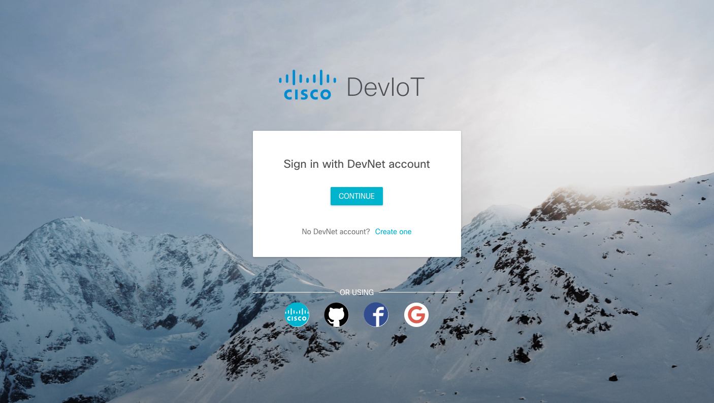
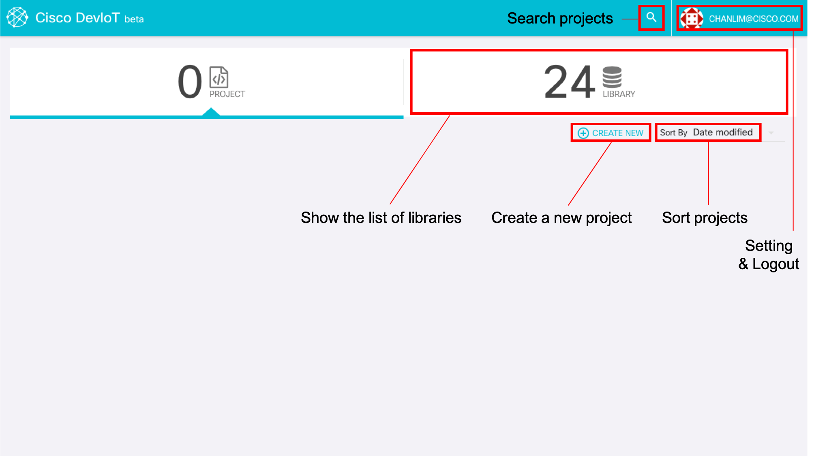
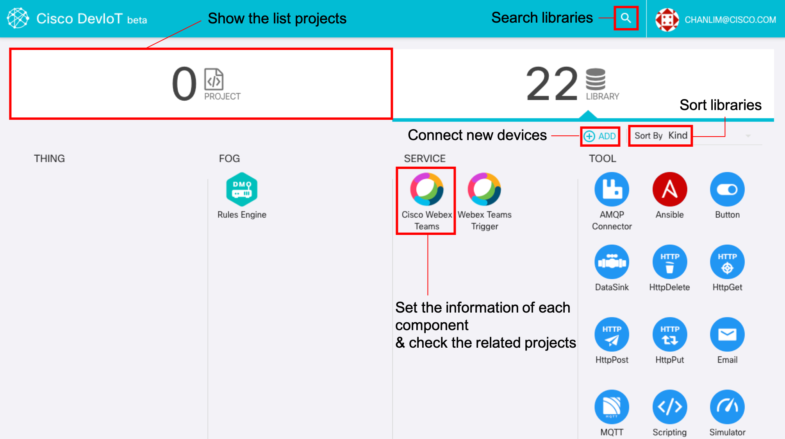

# Go through DevIoT

Open [DevIoT](https://deviot.cisco.com)!. You can sign-in DevIoT with 5 kinds of social login: DevNet, Cisco NetAcad, Github, Facebook, Google.

You can see the dashboard page after signing in. It shows the projects you have made and the libraries you can use.

If you click 'library' tab, you can see the list of libraries you can use.

* **THING**: The real sensors or objects connected to DevIoT
* **FOG**: The infrastructure component which determining the logic of a program
* **SERVICE**: The web service like Webex Teams connected to DevIoT
* **TOOL**: The virtual sensor running on the web

Every component can be grouped into 'input' and 'output'. 'Input' is the component sending data to 'fog' according to its state. 'Output' is the one receiving from 'fog'. For instance, a temperature sensor is 'input' sending temperature data to DevIoT, and a LED is 'output' lighting on/off by the data from DevIoT.

### FOG
* **Rules Engine**: An only component in FOG. It determines the logic of your program. There is no priority between rules in Rules Engine. It utilizes [Cisco® Data in Motion](https://developer.cisco.com/site/data-in-motion/).

### SERVICE
* **Cisco Webex Teams** (Output): You can send your message to a specific chat room in Webex Teams
* **Webex Teams Trigger** (Input): It detects the message to DevIoT bot with the user-speific token.

### TOOL
* **Button** (Input): It works as a virtual button. It sends a value(0/1) depending on its state(released/pressed).
* **Timer** (Input): It sends 1 on every specified time.
* **Traffic Light** (Output): It works as a virtual traffic light. It has three kinds of light: green, yellow, red.
* **Chart** (Output): It makes a graph of connected data from input components.
* **ImageView** (Output): It shows the image of input data if image data is available.
* **WordCloud** (Output): It shows the word cloud composed of input data if text data is available.