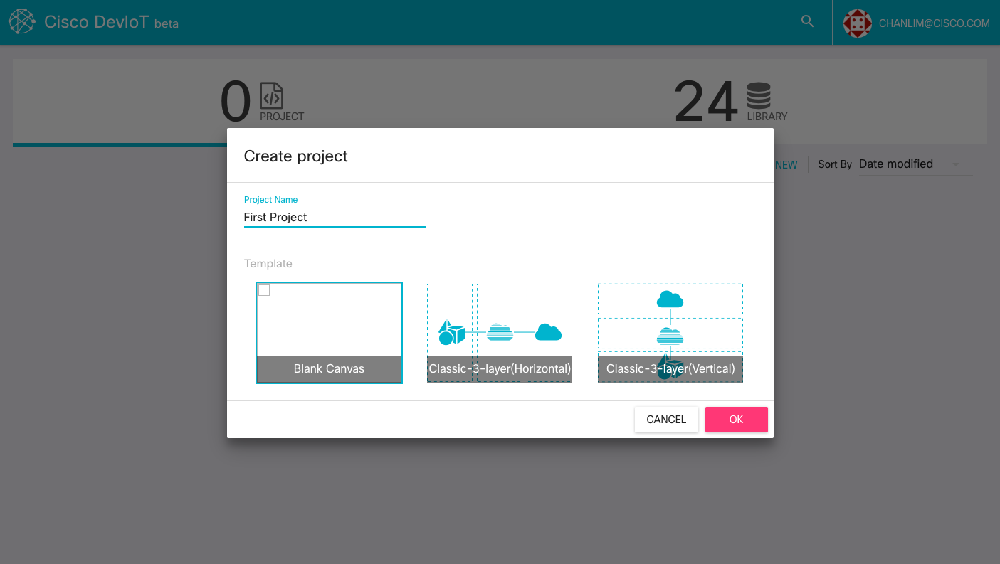
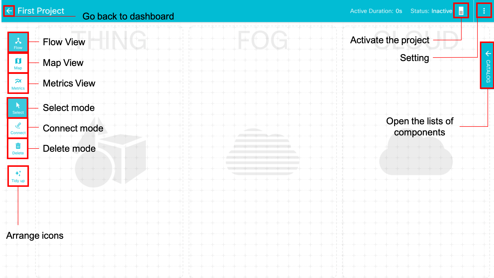
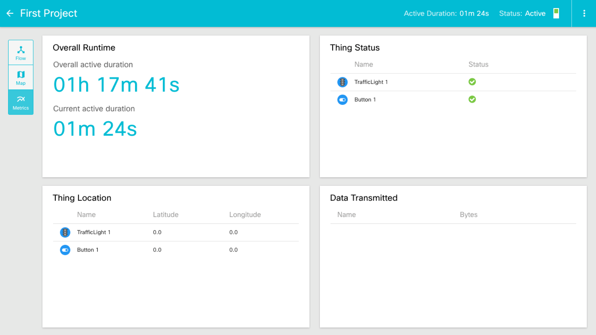

# Create a new project
By clicking the 'CREATE NEW' button, you can create a new project.
On the popup window, write the name of a new project and choose the template of projects. You can change the template later.

You can see the workspace page for making a project. This is the place where you can build your program. The details are explained in the next step.

#### View
* **Flow View**: The **default** view in workspace. Flow View shows the workspace for builing program.
* **Map View**: Map View shows the location of each component on a map.
* **Metrics View**: Metrics View shows the statistics of project like active duration, the status and location of components. The following figure is the workspace in Metrics View.

#### Mode

There are three modes in Flow View.
* **Select mode**: The **default** mode. You can drag-and-drop components. If there is one Fog component, the connection is automatically generatedßß.
* **Connect mode**: You can connect two components in Connect mode. You can only connect between a Fog coßmponent and a non-Fog compoent. You need to double-click icons to connect them.
* **Delete mode**: You can delete components from the project. Components will be removed by clicking red 'x' buttons.

#### Button

* **Tidy up**: 'Tidy up' button arranges all icons on your workspace.
* **Clear**: 'Clear' button is shown only on Delete mode. It removes all icons. You can't undo it. BE CAREFUL!