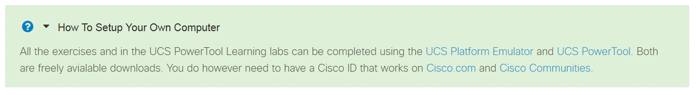
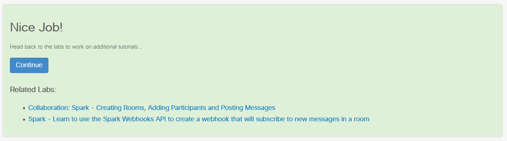

## Step 5. BYOD Information
The byod.html ("bring your own device") file should be authored in HTML, placed in the directory at the same level with the JSON file and contain information about any special setup or requirements for successfully completing the Learning Lab. If your lab requires to have Python installed, if you need to have special hardware or any additional software, this is the file that should contain that information. This will be displayed as an "accordion" element at the top of your lab. Enable this by setting your lab JSON file property `"byod": true`.

Example file `byod.html`:
```
<div>
  <p>All the exercises and in the UCS PowerTool Learning labs can be completed using the <a href="https://communities.cisco.com/docs/DOC-66688" target="_blank">UCS Platform Emulator</a>
  and <a href="https://software.cisco.com/download/release.html?mdfid=286305108&flowid=&softwareid=284574017&release=2.0.1&relind=AVAILABLE&rellifecycle=&reltype=latest" target="_blank">UCS PowerTool</a>.
  Both are freely avialable downloads.  You do however need to have a Cisco ID that works on <a href="http://www.cisco.com" target="_blank">Cisco.com</a>
  and <a href="http://communities.cisco.com" target="_blank">Cisco Communities</a>.</p>
</div>
```
This will result in the following element being displayed at the top of your Learning Lab:



## Step 6. Related Labs
To display related labs on the completed page, you can reference other labs by adding a JSON array named `related`. You can determine the related lab ID to use by looking at the URL for a given lab. The lab ID is contained in the path between `labs/` and `step`. Example: `#/labs/cmx/step/1` where cmx is the lab ID.

Example file `collab-spark-auth.json`:
```
{
  "labId": "collab-spark-auth",
  "files": [
    {"title": "1.md"},
    {"title": "2.md"},
    {"title": "3.md"},
    {"title": "4.md"}
  ],
  "related": [
    {
      "labId": "collab-spark-messages",
      "title": "Collaboration: Spark - Creating Rooms, Adding Participants and Posting Messages"
    },
    {
      "labId": "collab-sparkwebhook",
      "title": "Spark - Learn to use the Spark Webhooks API to create a webhook that will subscribe to new messages in a room"
    }
  ]
}
```
This will result in the following element on the completion page of the `collab-spark-auth` lab:


