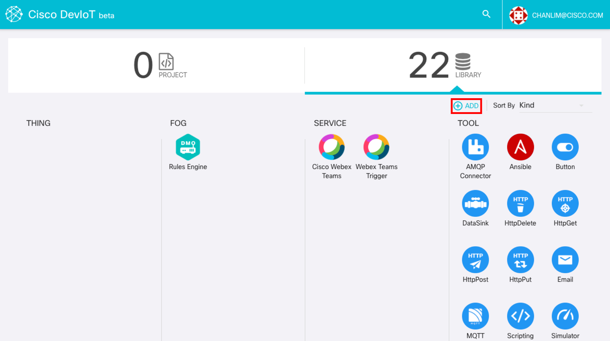
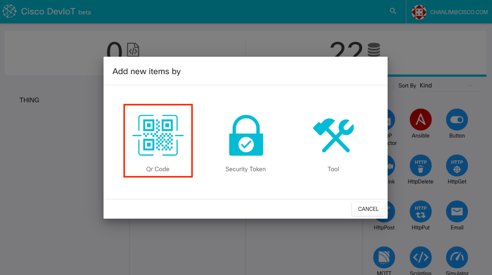
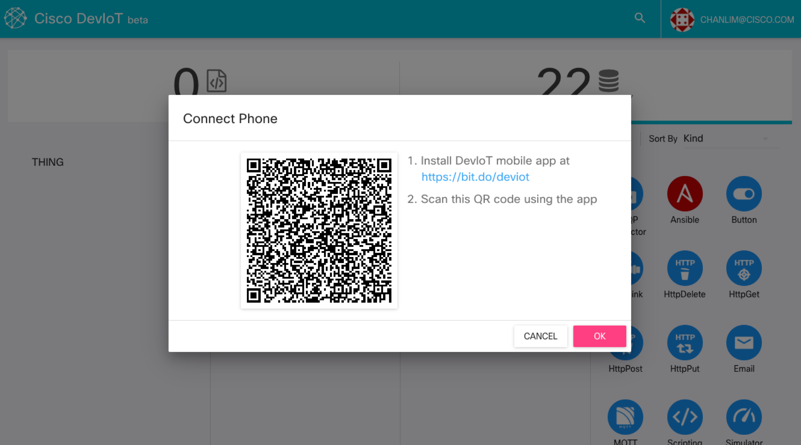
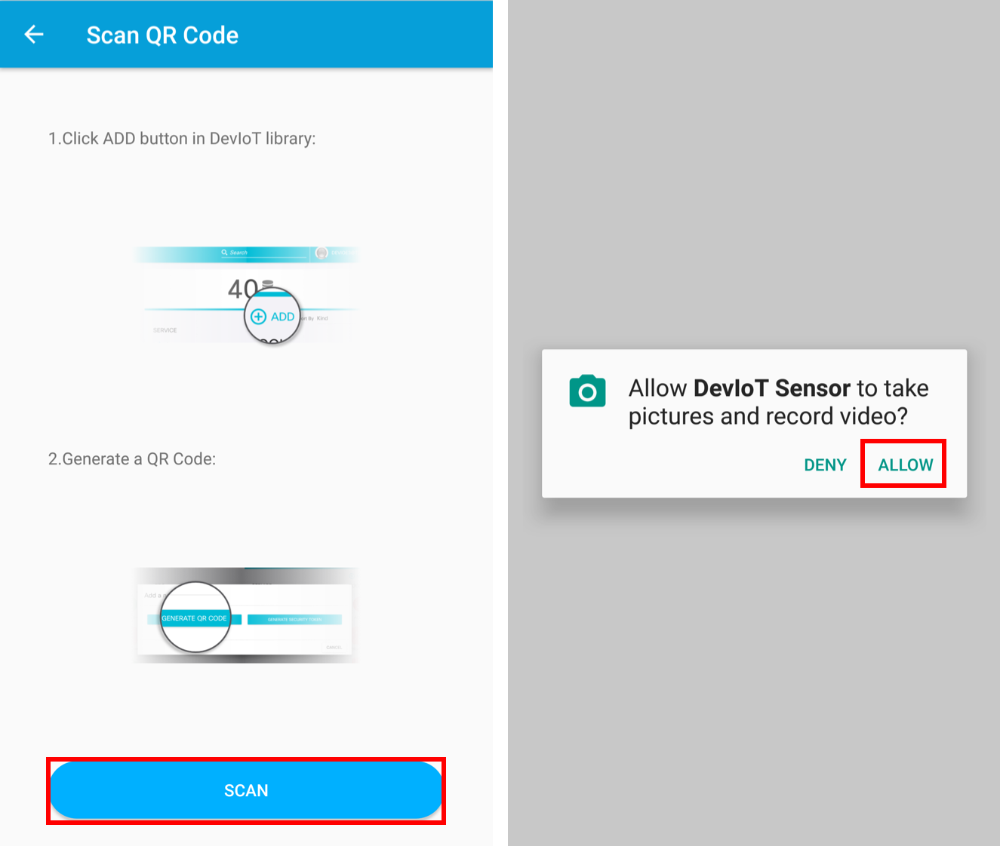
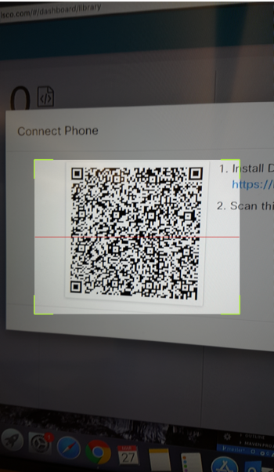

# Connect by scanning a QR code

If your phone have a working camera and you have a monitor to display a QR code, you can connect your phone to DevIoT by scanning a QR code. If not, please skip to the next page '**Manually connect**'.

### 1. Click 'ADD' button on library tab and click 'Qr Code' button (web)

You can see the QR code.

### 2. Run DevIoT app and click 'SCAN QR CODE' button (mobile)

- As you click 'SCAN' button on the app, the app will ask the permission to camera. It needs to allow it to scan the QR code.

### 3. Scan QR code on monitor using camera (mobile)

- Place the QR code in step 1 inside the box. 

DevIoT app automatically scan the QR code and connect the phone to DevIoT. You will see the new components on the dashboard in DevIoT.

Now you connect your smartphone to DevIoT. If there is no problem on this page, you can skip to the last page '**Build your IoT program using your mobile device**'.
