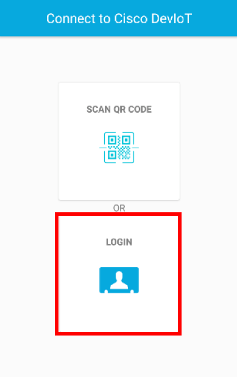
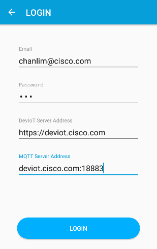
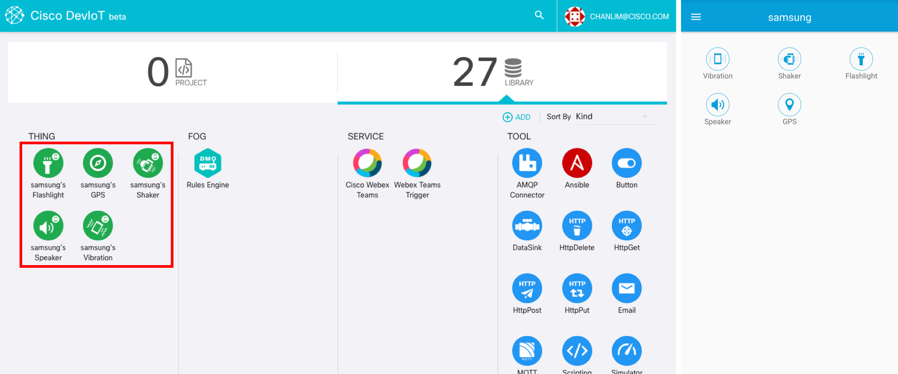

# Manually connect

If you cannot use camera or encountered an error scanning QR code, you can use 'manual login'.

### 1. Click 'LOGIN' button on the app

### 2. Write down the information and click 'LOGIN' button
- Write your account, which is on the sidebar in DevIoT web, on 'Email' tab.
- You can any text for 'Password' because password is disabled now.
- 'DevIoT Server Address' is 'https://deviot.cisco.com' or 'deviot.cisco.com'
- 'MQTT Server Address' is 'deviot.cisco.com:18883'

After that, you will see the new components on the dashboard in DevIoT.

