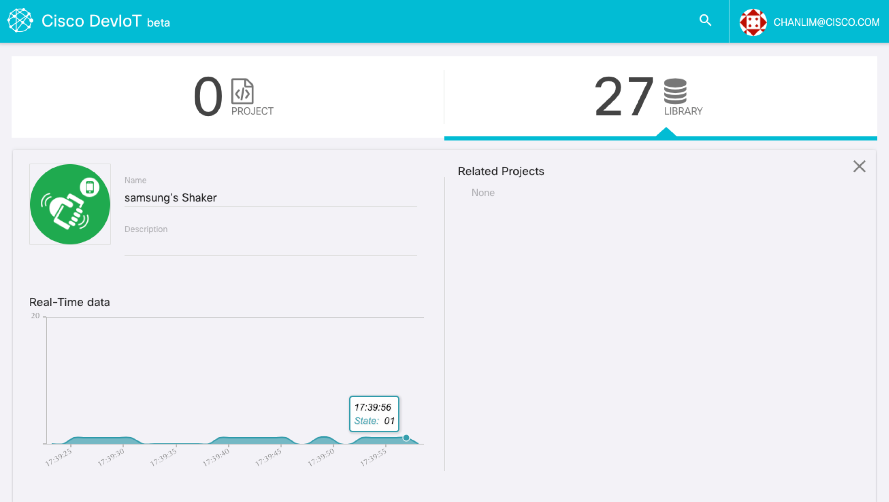
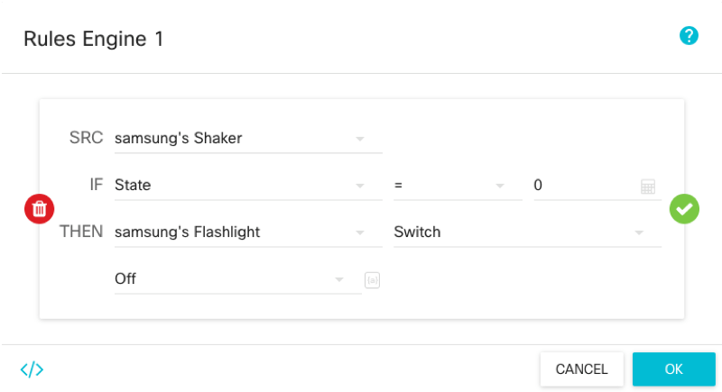
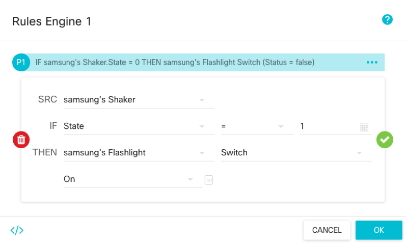

# Build your IoT program using your mobile device

### 0. Test components

Before building an IoT program, let's check whether your phone is well connected to DevIoT. 

You will see the real-time graph as you click the 'Shaker' button on library tab. If there is no graph under 'Description', it means connection between your phone and the DevIoT servor fails.

You can test your shaker sensor by shaking your phone. The 'State' value changes from '00' to '01' when you shake your phone.

### 1. Drag-and-drop components on your project

- Make your project and drag-and-drop 'Rules Engine', 'Shaker', and 'Flashlight' on your project

### 2. Set the logic
- Rule 1: If Shaker's state equals to 0, Flashlight's Switch is off.

- Rule 2: If Shaker's state equals to 1, Flashlight's Switch is on.

With these 2 rules, you can control the flashlight of your phone by shaking your phone.

### 3. Activate the project and Test it
- Don't forget to activate your project by clicking the switch on the sidebar.

The following video is the demo for this program. As the phone is being shaken, the flashlight of the phone is turned on.

## Conclusion
Now you can connect your smartphone to DevIoT, and build your IoT program. You can connect other devices, and build more complicated program.