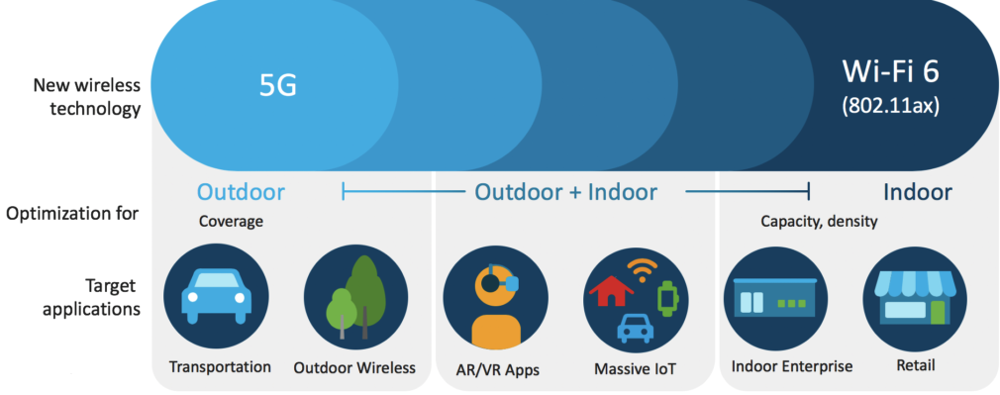

# Introduction to Wi-Fi 6
## Objective
- Learn what features make Wi-Fi 6 powerful
- Understand how Wi-Fi 6 will affect the industry and business
- Understand what developers and engineers should know about Wi-Fi 6

Completion time: 20 mins

## What is Wi-Fi?
 
Wi-Fi (pronounced *Why-Figh*) might be one of the most important words for modern people. **Wi-Fi** is a wireless networking technology providing wireless network connections and Internet via radio waves. Wi-Fi is the brand name which applies IEEE 802.11, the standard for Wireless LAN protocols. The Institute of Electrical and Electronics Engineers (IEEE) is the technical professional organization, which also develops global standards. It is pronounced *Eye-triple-E*.
So Wi-Fi connects your Wi-Fi certified devices to a wireless router, usually called an access point(AP). Wi-Fi transmits radio wave signal at frequencies such as 2.4 GHz or 5GHz.

## History of Wi-Fi
The start of Wi-Fi technology turns back nearly 50 years. In 1971, the University of Hawaii built a wireless packet data network, ALOHAnet, connecting 7 computers in 4 islands without phone lines. It acted as a proof of concept for wireless networking. But it was in 1997 that the first version of the 802.11 protocol, showing up to 2 Mbps speed, was published by IEEE. In 1999, **Wi-Fi** has gotten its marketing name 'Wi-Fi' instead of the long standard name and the 802.11b standard is approved, showing 11 Mbps maximum speed on 2.4 GHz. In between, vendors get together in what will become the WI-FI Alliance and they labeled “Wi-Fi certified” to devices and APs that implement the same parts of (and in the same way) the 802.11b standard. 

802.11a was released a month later, offering up to 54 Mbps on 5.0GHz. But the cost of bringing WI-Fi to that new band was higher and the range was shorter. So in 2003, the 802.11g standard is introdued, combining earlier versions and bringing the equivalent of 802.11a back to 2.4 GHz.
802.11n, which was launched in 2009, reached the max speed of 600 Mbps by utilizing MIMO technology. It can use both 2.4 GHz and 5 GHz. In 2013, the fifth generation of Wi-Fi, called 802.11ac is released. It is operating on 5 GHz  used Multi-user MIMO and achieved the max speed of 3.5 Gbps. In 2020, Wi-Fi 6, the topic of this learning lab, will be launched.

## What is Wi-Fi 6?
**Wi-Fi 6** is the latest version and the sixth generation of the Wi-Fi Alliance certification. It implements the essence of IEEE **802.11ax**. The certification will be finalized at the end of 2019. The goal of Wi-Fi 6 is not only to make Wi-Fi speed faster, but also to deliver *high-efficiency wireless* (HE), which means higher throughput in a denser area consistently, and to improve *Quality of Experience* (QoE). Wi-Fi 6's goal is to serve a reliable and consistent data stream in the presence of many users. 

The current challenges around the wireless industry include the increase of ultra-high-density (UHD) contents or real-time applications such as AR and VR, the need to support low-power devices in the IoT space, and the Ultra-Reliable Low-Latency Communication(URLLC) like medical control. Wi-Fi 6 is expected to meet these challenges.

## The relation between 5G and Wi-Fi 6

Both **5G** and **Wi-Fi 6** are implemented with overlapping goals in mind, but they will co-exist to support different use cases. Wi-Fi 6 is suitable for indoor wireless networks, while 5G will mostly applies to outdoor networks. For example, Wi-Fi 6 can provide high-performance indoor networks with reasonable cost to high-density areas like stadiums, convention centers, and concert halls. 5G is preferred for the environment traveling at high speed like a car in highway or an express train, although Wi-Fi 6 can also improve normal outdoor connectivity. It is clear that both technologies will complement each other and play a crucial role in many industries.
