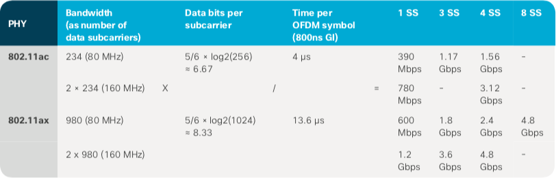

# The new features in Wi-Fi 6 (1)
Most improvements in the previous Wi-Fi generations targeted 3 areas: **Modulation Scheme**, **Spatial Streams**, **Channel Bonding**. Wi-Fi 6 achieved performance improvement in not only these areas but also individual latency, which translates in consistent airtime efficiency.. The traditional improvement usually for *speed* is described in this page, and the new kind of improvement including **Airtime Efficiency** is explained in the next page.

## The factors of wireless speed

Let's first talk about which factors affect the speed of Wi-Fi. You don't have to worry about the unfamiliar terms. They are explained in the next sections. The speed of wireless communication is defined by how much data is transmitted in a specific time in terms of digital bits. Mbps(Megabits-per-second) or Gbps(Gigabits-per-second) are commonly used.

Wi-Fi doesn't use the whole frequency range at a time. It divides the range into several *channels* of specific width such as 80MHz. With modulation techniques like OFDM or OFDMA, Wi-Fi can send multiple streams of data concurrently within a channel. The smallest subset that can transport data is called *subcarrier* or *data tone*. Each subcarrier encodes a set of digital bits. In the time domain, the shortest unit composed of a set of bits in a channel is called *symbol*. So, 1 symbol has several bits transported per unit of time (in the time domain), and 1 channel contains several subcarriers (in the frequency domain).

The last part is that Wi-Fi 6(or 5) is able to send independent radio waves from different radio chains (an individual radio connected to an antenna) of an AP by using MIMO (Multiple Input, Multiple Output). Each radio chain transmits what is called a *spatial stream*. And one thing not to overlook is all subcarrier or all bit does not carry information. Some subcarriers are used for other purposes like synchronization or preventing interference. Some bits are for error correction.

So the peak wireless speed in a channel is the product of four factors: the channel width, which determines the number of data subcarriers, data density (how many bits per seconds) carried by each subcarrier (the symbol rate), and the number of spatial streams send in parallel.

peak wireless speed per channel = symbol rate x number of data subcarriers x data bits / second per subcarrier x number of spatial streams

## Modulation Scheme

Wi-Fi 6 improves the modulation scheme from ***256 QAM*** of Wi-Fi 5 to ***1024 QAM***. The details about QAM is described in the next section. You can think QAM as the way to convert digital bits into radio waves. With *256 QAM*, 8(=log2256) bits is transmitted in a subcarrier. Whereas *1024 QAM* sends 10(=log21024) bits per subcarrier. Therefore, *1024 QAM* is 25% faster(10/8) than *256 QAM* without considering other factors. Both Wi-Fi 5 and Wi-Fi 6 use the same code rate of 5/6, which means they repeat 1 every 6 bits, to account for possible random losses during the transmission. It is in the third column in the above table.

The bandwidth of a subcarrier in Wi-Fi 5 is 312.5kHz. So a channel of the width 80 MHz has a total of 256 subcarriers. Among 256 subcarriers, the number of data subcarriers is 234. Wi-Fi 6 increases the symbol duration 4 times longer from 3.2 μs of Wi-Fi 5 to 12.8 μs. This seems to mean that Wi-Fi 6 should be slower. But at the same time, the bandwidth of a subcarrier diminishes to 78.125kHz. An 80MHz channel in Wi-Fi 6 can have 980 data subcarriers among 1024 subcarriers. If we consider the smallest *guard intervals*, the time interval between two symbols(0.4 and 0.8 μs for Wi-Fi 5, 0.8, 1.6, 3.2 μs), the time per symbol of Wi-Fi 5 and Wi-Fi 6 becomes 3.6μs and 13.6μs. The ratio of the number of subcarriers per unit time is (980/13.6)/(234/3.6)=1.1. So in terms of the number of subcarriers in unit time, Wi-Fi 6 is 10% higher than Wi-Fi 5. What this means for your WI-FI transmission is that the symbol slows down, so interferences affect your signal less than with Wi-Fi5. And as you have many more subcarriers, the overall speed increases.

The change of modulation scheme improves the speed nearly 40%, but there is always the **tradeoff** between one factor and others. To achieve faster performance, it is necessary to turn signal up or reduce noise.

## Spatial Streams
Wi-Fi uses MU-MIMO(Multi-User Multiple Input Multiple Output) technology to connect multiple clients(devices) simultaneously. MIMO is the technology to transmit signals through multiple spatial streams by using multiple antennae. Single-user MIMO(SU-MIMO) sends multiple streams of data simultaneously to a single station with MIMO, while MU-MIMO sends individual streams of data to separate users simultaneously. MIMO is enabled by techniques like beamforming and space-time coding.

Wi-Fi 6 supports 8x8 MU-MIMO, which means it can transmit and receive 8 streams of data concurrently. So 8 clients can be connected concurrently or 8 times faster connection can be achieved to a single user. To secure enough spatial streams, clients should be apart from each other which is hard to achieve in a high-density area.

## Channel Bonding
The bandwidth of a channel is proportional to the number of subcarriers in a channel. So if the bandwidth of a channel increases or two channels are bonded into a new channel, the wireless speed in a channel increases. Wi-Fi 6 provides 160MHz (two 80 MHz channels, or eight 20 MHz channels bonded together)channel bandwidth like Wi-Fi 5. However, channel bonding reduces the number of available channels due to the limited frequency range. It may cause interference with other APs in the environment sharing multiple APs like an office. This problem is helped by BSS coloring, explained in the next page.
