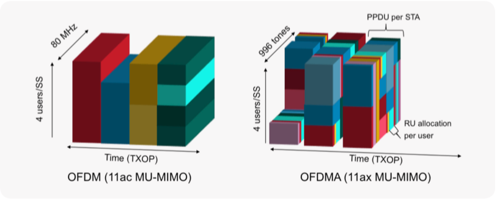
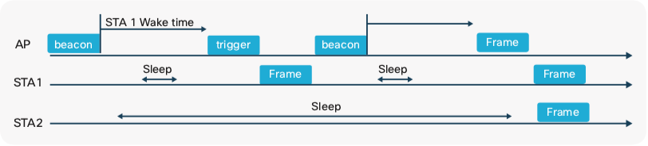

# The new features in Wi-Fi 6 (2)

The challenges that we encounter in improving performance in the previous page can be resolved by enhancing **airtime efficiency**.

## Resource allocation
Wi-Fi 6 chooses to allow **OFDMA** in addition to OFDM of Wi-Fi 5. The difference between the two modulation techniques is the resource allocation for multi-users. You can simply think the multi-user version of OFDM is OFDMA.

In OFDM, multiple users are separated by only **space** (spatial streams) and **time**, not by frequency. In other words, only one user transmits at any given time. OFDMA adds a third multi-user dimension, **frequency** or data tone. Like in the below picture, OFDMA diagram (the right figure) is also divided on the z-axis. OFDM cannot allot each channel to multi-users, whereas OFDMA is able to allot each subcarrier to different users.

Sub-channel allocation is dynamically done based on the request of a device or a station (STA). The AP coordinates subcarrier allocation (called Resource Units) based on the priority of traffic. Wi-Fi 6 also allows for a technique called **DCM (Dual Sub-Carrier Modulation)**, which repeats a symbol in another subcarrier to prevent interference or data loss. With this technique, data speed can decrease but better signal and better ranges are offered. DCM is useful, for example, with IoT outdoor deployments.

OFDMA feature brings many advantages to Wi-Fi 6. In a high-density environment, if there is a client who uses only a small amount of data traffic, OFDM wastes most of the bandwidth of the channel assigned to the client. But OFDMA can utilize the spare bandwidth for other clients, keeping its throughput high with many users.

## Improving capacity
It is a challenge to overcome interference in an environment where users share the same channel in the same physical space. This happens in a mobile environment in a large place sharing APs. A client device should decide which AP it will connect to, among several APs to choose from. An AP and its clients represent a BSS (Basic Service Set). When two neighboring APs are on the same channels, clients between these APs hear the traffic from two overlapping BSSes (OBSS). This can cause OBSS interference.

To limit this issue, Wi-Fi 6 introduces **BSS Coloring**. BSS coloring is the way to differentiate BSS in the same channel by adding BSS number (color) in the PHY header. So clients can ignore the traffic showing ‘other’ colors.

## Flexible low-power device scheduling
This section is not directly related to airtime efficiency, but about a power-saving mode. The prior versions of Wi-Fi have power saving modes like Unscheduled Automatic Power Save Delivery (U-APSD). U-APSD allows a client to sleep and conserve battery. But a client does not know when the AP has broadcast traffic of interest. SO the client should wake up periodically to hear the AP beacons generally at multiples of 102.4 ms intervals. This periodic listening to beacons restricts potential energy-saving.

So Wi-Fi 6 introduces the new power-savings mode called **Target-Wakeup Time (TWT)**. STA can schedule any length of sleeping time up to 5 years. This will help many small IoT devices to save their energy.

