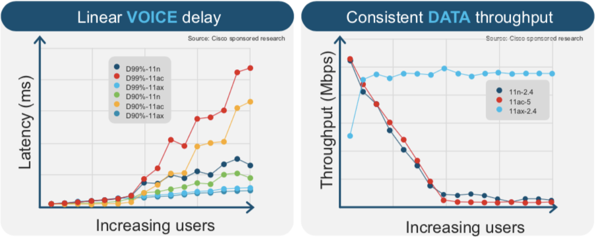
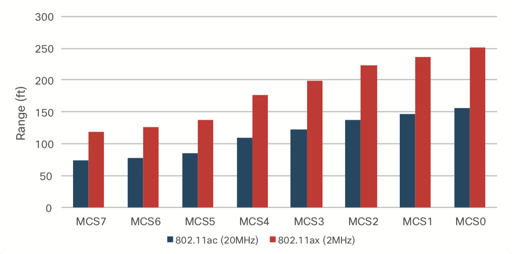
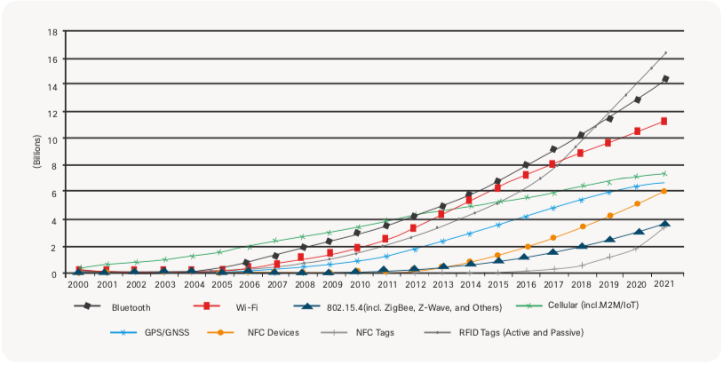
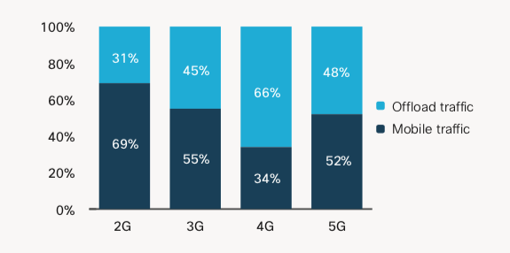

# How Wi-Fi 6 will change business and industry
## Industrial advantages of Wi-Fi 6
#### speed
Wi-Fi 6 provides a maximum speed of 4.8 Gbps on an 80 MHz channel using 8×8 MU-MIMO, while Wi-Fi 5 shows the maximum speed of 3.5Gps in the same condition. It is about 40% faster.

#### high density
Wi-Fi 6 shows its strength especially in high-density environments. With OFDMA, it can efficiently allocate the bandwidth resource to multi-users. As a result, it shows consistent throughput and low latency for each user, even when the number of users per AP increases (the sky-blue graph), unlike the prior versions as you can see in the below graph.

#### low-power device
Wi-Fi 6 has many features to save energy usages like TWT or DCM. It is critical for the IoT devices with a limited battery. Normal wireless devices, as well as low-power devices, get benefit from it.

#### range
Wi-Fi 6 delivers longer range than previous versions for each modulation, as shown in the graph below. Multiple GI (Guard Interval) gives Wi-Fi 6 the chance to optimize. Longer GI is good for outdoor. And narrower subcarrier bandwidth or DCM reduces interference. The increased reliability ensures that clients can have the same quality connection at a longer distance.

#### compatibility
You don't need to worry about compatibility. A Wi-Fi 6 device must support previous modes of Wi-Fi. A Wi-Fi 6 access point can also communicate with the previous version of Wi-Fi devices. So Wi-Fi 6 can co-exist with the previous versions rather than changing existing devices. But the prior version of devices can't take the advantages of Wi-Fi 6.

## Industrial Impact
#### IoT space
Wi-Fi 6 supports low-power mode and deterministic wireless service (which guarantees bounded latency), for which IoT devices have a need. With scalability and ease of management, Wi-Fi has been selected as the indoor IoT platform. In the below graph, the usages of RFID tag, Bluetooth and Wi-Fi (red graph) are predicted to be rapidly increasing.

#### Real-time applications like 4K/8K video and AR/VR
As real-time applications like 4K/8K video service, AR (Augmented Reality) or VR (Virtual Reality) require significant throughput and low latency, Wi-Fi 6 is designed to satisfy such demand even in a dense area. Wi-Fi 6 supports high-bandwidth real-time applications to create new kind of experience.

#### mobile data offloading

The above graph is the trend of mobile data offloading. Each generation of the cellular network (2G, 3G, and 4G) has offloaded a large ratio of traffic into Wi-Fi network because of its speeds and economics. This trend will continue within the new cellular technology, 5G.
